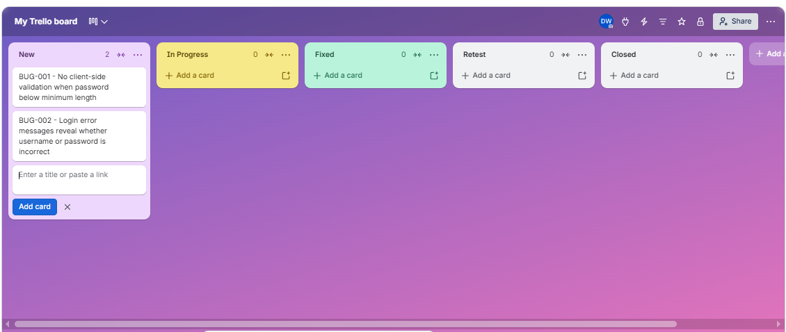
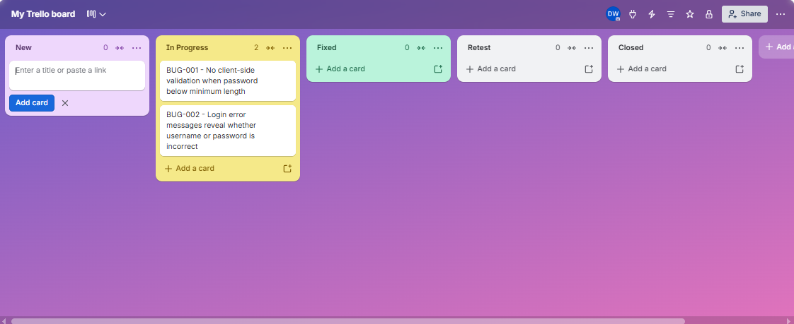
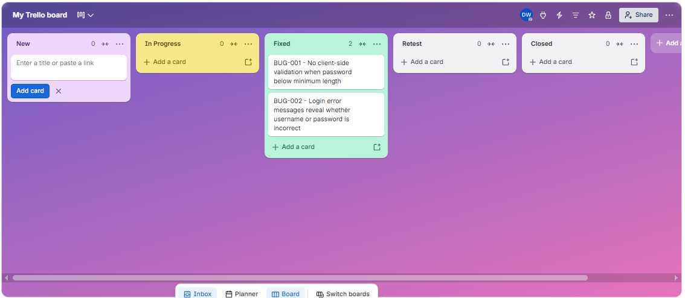
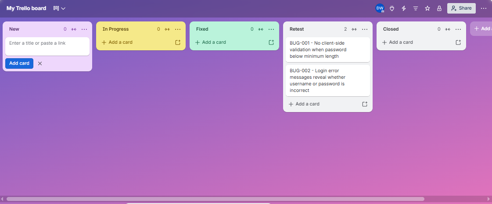
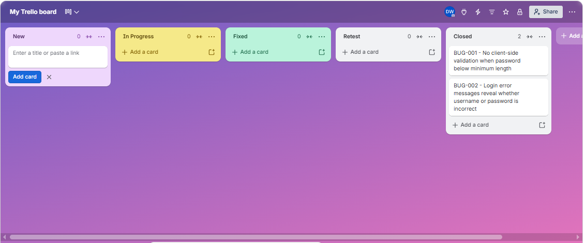

# Week 1 — Foundations: Login Form Test Case Design & Bug Reporting

## Objective

Apply core QA foundations — SDLC/STLC concepts, functional test types, and test case design techniques — to a real, testable feature: a standard login form. This case study demonstrates the reasoning process behind each test case, not just the output.

## Feature under test: Login Form

Assumed specification (documented explicitly here since no formal requirement doc was provided — a real QA would confirm these with a Product Owner/BA before writing test cases):

| Field | Rule |
|---|---|
| Username | Required, 3–20 alphanumeric characters |
| Password | Required, 8–20 characters, must contain at least one letter and one number |
| Remember me | Optional checkbox |
| Submit | Disabled until both required fields are non-empty |

## Approach

1. **Equivalence Partitioning** on `username` and `password` to cover valid/invalid input classes efficiently instead of testing every possible string.
2. **Boundary Value Analysis** on both fields' length constraints, since off-by-one bugs (`<` vs `<=`) are the most common source of real validation defects.
3. **Decision Table Testing** to cover the combined outcomes of username/password validity — a class of bug EP/BVA alone would miss.
4. **Supplementary functional & security checks** (masking, persistence, injection handling) to cover behavior not captured by pure input-partition analysis.

See [test-cases/login-test-cases.md](test-cases/login-test-cases.md) for the full set of 20 test cases with this breakdown.

## Bugs found

Tested against public demo login pages (e.g. `the-internet.herokuapp.com`, `saucedemo.com`) plus the assumed spec above. See [bug-reports/](bug-reports/) for full reports.

| ID | Summary | Severity | Priority |
|---|---|---|---|
| [BUG-001](bug-reports/bug-001-empty-form-misleading-error.md) | Empty required fields are reported as "invalid" instead of "required" | Low | Low |
| [BUG-002](bug-reports/bug-002-user-enumeration-via-error-messages.md) | Login error messages reveal whether username or password is incorrect (user enumeration) | Medium | Medium |

New reports follow [TEMPLATE-bug-report.md](bug-reports/TEMPLATE-bug-report.md).

## Bug tracking workflow

Bugs were tracked on a Trello kanban board whose columns mirror the bug life cycle: New → In Progress → Fixed → Retest → Closed. BUG-002 was moved through every status to practice the full workflow.

| 1. New | 2. In Progress | 3. Fixed | 4. Retest | 5. Closed |
|---|---|---|---|---|
|  |  |  |  |  |

## What I'd do differently with more time

- Confirm the actual spec with a real PO instead of assuming field rules
- Add negative security testing (XSS payloads, rate-limiting/brute-force checks) beyond the single SQL-injection case included here
- Pair this manual suite with an automated regression suite (planned for Week 3–4 of this portfolio)
